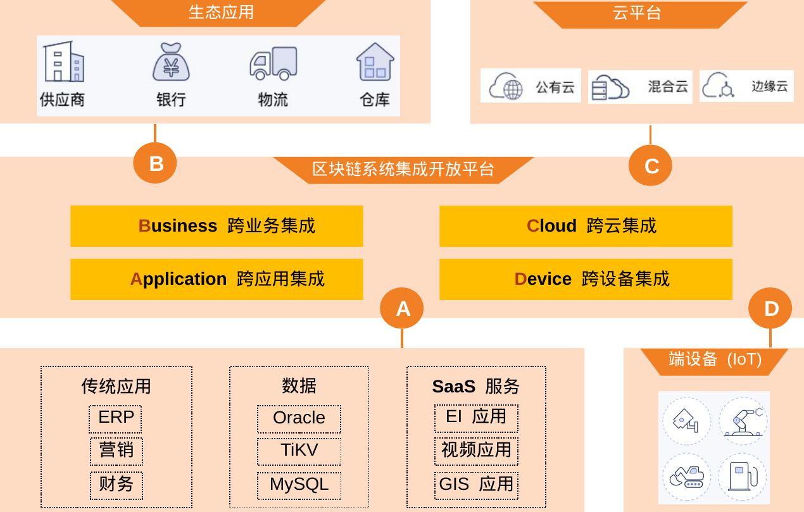

# CITA-Cloud 介绍
### 产品定位
`CITA-Cloud`定位于可信的连接不同的业务系统，包括传统应用，行业应用，云和物联网设备。

详情参见[产品定位白皮书](https://talk.citahub.com/t/topic/1662)。
### 系统架构
`CITA-Cloud`是一个完整的解决方案，除了区块链底层，还包括中间件层面的各种服务，以及上层的数字资产管理层。支撑企业用户在各种不同的基础设施上直接构建各种行业解决方案的能力。

### 运行环境
`CITA-Cloud`默认运行在`k8s`环境中，原因有：

- 方便支持各种基础设施，尤其是各种云设施。
- 方便复用云原生社区已有的技术。
- 方便采用微服务架构，可以做到语言无关，开发者可以选择最适合的语言，复用已有的库或者代码。
- 方便实施自动化运维。
### 工程仓库

`CITA-Cloud`的代码仓库都在`github`上[cita-cloud组织](https://github.com/cita-cloud)下。主要代码仓库有：

- [rfcs](https://github.com/cita-cloud/rfcs) 存放白皮书以及后续的改进建议。
- [cita_cloud_proto](https://github.com/cita-cloud/cita_cloud_proto) 存放`CITA-Cloud`微服务间`gRPC`接口定义文件。
- [runner_k8s](https://github.com/cita-cloud/runner_k8s) 用于生成在`k8s`上运行所需配置文件的工具。
- [docs](https://github.com/cita-cloud/docs) 存放文档。

其余仓库主要是各个微服务实现。仓库名称以`cita_cloud_proto`中定义的微服务名称开头，下划线后接用于标识不同实现的名称。比如`storage_sqlite`，是基于`sqlite`实现的`storage`微服务。发布件以`Docker`镜像的方式发布在`DockerHub`上，参见[链接](https://hub.docker.com/u/citacloud)。
### 运行
在`k8s`环境中运行`CITA-Cloud`，参见[链接](https://github.com/cita-cloud/runner_k8s)。
